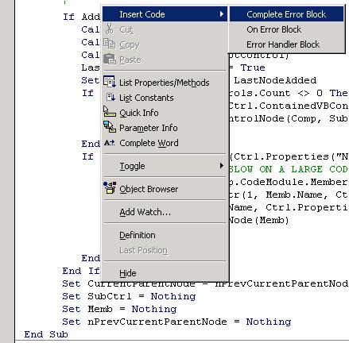



## Code Inserter 1\.1

### Description

This little AddIn adds Menu Items to the Code Editor Window's PopUp Menu. Selecting one of these Items will insert code/text from a file into your code. The Menu Items and Code can be easily maintained thru text files.

This is the second submission on this Project and I am proud to announce that I have solved the problem in the previous version. Everything is now maintainable through text files! This version is a little more advanced than the previous version but it does have more comments etc so hopefully should be easily understood by all and an excellent example of the potential of Classes an what I would call OO programming.

Chris basically got me started by submitting some source which got me thinking. I started out trying to use an array to create multiple menu items but this did not work. So I started playing around and eentually created a class with all the Menu Item pieces in. I could then create an array of this class and so providing me with multiple menu items. Now I don't know a lot about OO programming but to me this is OO programming because each Menu Item is now a class object and I can create as many as I like and all though a text file. Cool!
 
### More Info
 

             |
---                |---
**Submitted On**   |2002-10-23 20:06:04
**By**             |[Darryl Hasieber](https://github.com/Planet-Source-Code/PSCIndex/blob/master/ByAuthor/darryl-hasieber.md)
**Level**          |Beginner
**User Rating**    |5.0 (40 globes from 8 users)
**Compatibility**  |VB 6\.0
**Category**       |[Miscellaneous](https://github.com/Planet-Source-Code/PSCIndex/blob/master/ByCategory/miscellaneous__1-1.md)
**World**          |[Visual Basic](https://github.com/Planet-Source-Code/PSCIndex/blob/master/ByWorld/visual-basic.md)
**Archive File**   |[Code\_Inser14898510312002\.zip](https://github.com/Planet-Source-Code/darryl-hasieber-code-inserter-1-1__1-40297/archive/master.zip)

